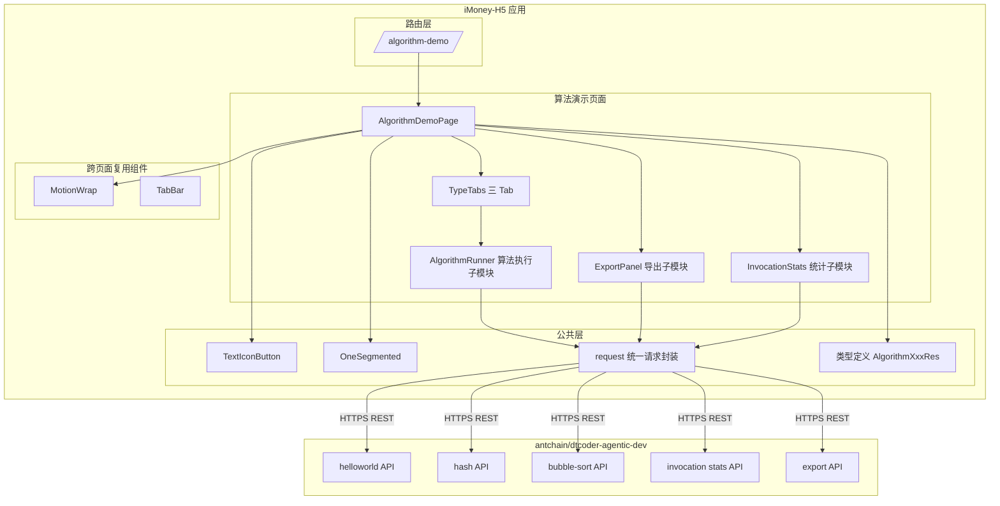
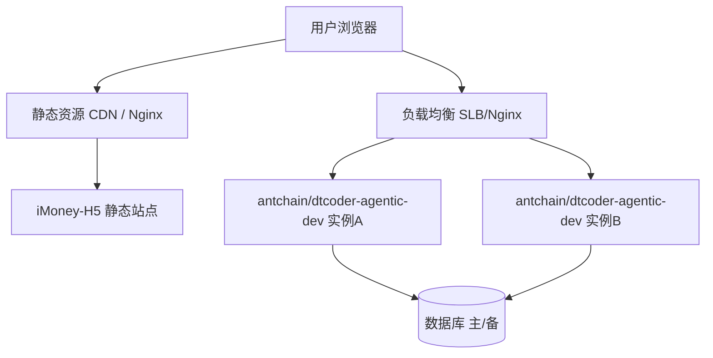
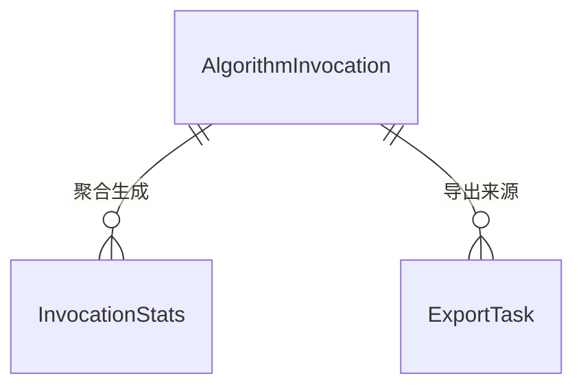
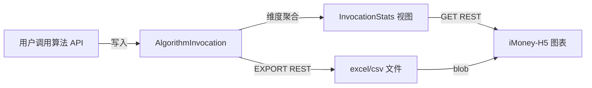
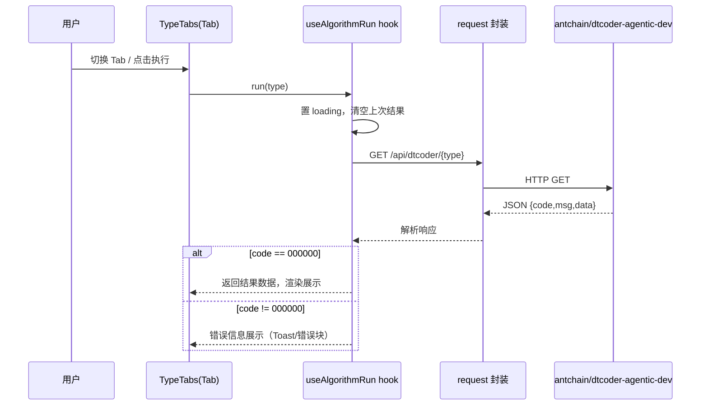
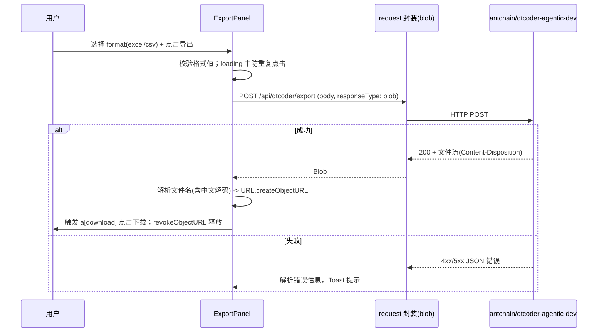
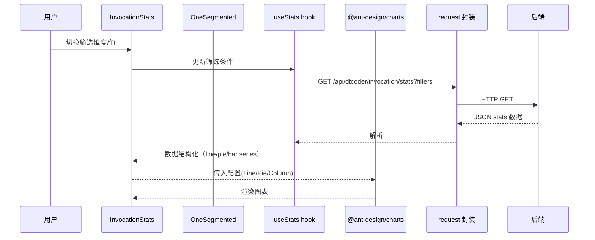

# 新增算法演示页面（/algorithm-demo）系分设计

> **文档元信息**
>
> | 项目 | 内容 |
> |------|------|
> | 文档版本 | v1.0 |
> | 作者 | DTCoder（系分生成） |
> | 创建日期 | 2026-08-20 |
> | 需求来源 | 任务需求描述（新增算法演示页面 /algorithm-demo） |
> | 评审状态 | 待评审 |
> | 功能归属仓库 | iMoney-H5-main（@umijs/max H5 工程）；本文档归档于 iMoney-main 仓库 .agents 目录（工作流 outputs 指定） |
> | 后端依赖仓库 | antchain/dtcoder-agentic-dev（跨仓库接口契约，本设计不实现后端） |

## 1. 需求与范围

### 背景与目标
- 背景：iMoney-H5 为基于 @umijs/max 的移动端 H5 应用。为演示与验证后端 antchain/dtcoder-agentic-dev 的算法能力与调用统计能力，需要新增算法演示页面。
- 目标：
  1. 提供 /algorithm-demo 路由页面，以 TypeTabs 组织三个算法 Tab（Helloworld/哈希算法/冒泡排序），逐 Tab 调用后端 REST API 并展示执行结果；
  2. 提供导出能力，调用 POST /api/dtcoder/export 以 blob 下载 excel/csv 文件；
  3. 提供 InvocationStats 调用统计图表组件，使用 @ant-design/charts 展示折线图/饼图/柱状图，支持按人员类型/层级/部门维度筛选；
  4. 页面组件遵循项目规范（.cursor/rules/h5-react-umi.mdc，等同 AGENTS.md 规范），使用 TextIconButton、TypeTabs、OneSegmented 等项目组件。

### 核心功能
- **F01** 算法演示页面路由（/algorithm-demo），独立路由不破坏既有 4 个 Tab 页面；
- **F02** TypeTabs 三 Tab（Helloworld/哈希算法/冒泡排序），Tab 切换 + 执行按钮；
- **F03** 算法执行结果展示：调用后端对应 REST API，含 loading/错误态与重试；
- **F04** 导出功能：POST /api/dtcoder/export，支持 excel/csv，blob 下载；
- **F05** InvocationStats 调用统计组件：@ant-design/charts 折线图/饼图/柱状图；
- **F06** 调用统计按人员类型/层级/部门维度筛选（与导出共享统一筛选状态）；
- **F07** 组件遵循项目规范：TextIconButton、TypeTabs、OneSegmented 等项目组件。

### 约束与非功能要求
- 技术栈：React18 + TypeScript + @umijs/max + antd-mobile + @ant-design/icons + framer-motion + Less（vw 适配，基准 375px）。
- 组件规范：函数组件 + Hooks；禁止 any/unknown；完整 TS 类型；接口返回统一命名 XxxRes；禁止硬编码接口地址；页面单文件 ≤300 行；禁止新增第三方状态库；禁止移除全局配置。
- 请求：内置 umi-request（umi max request）统一全局拦截。
- 图表：@ant-design/charts（coding 阶段新增依赖，按需/动态引入）。
- 非功能：接口超时与错误降级、防重点击、竞态丢弃、blob 内存释放、页面级 ErrorBoundary。

### 排除范围
- 不包含后端 antchain/dtcoder-agentic-dev 的实现（本设计仅定义接口契约，入参/出参类型对齐点见第 5 章）。
- 不包含算法逻辑实现（由后端提供）。
- 不包含 iMoney-main（Taro 小程序）页面实现。

### 需求功能清单与优先级

| 编号 | 功能点 | 优先级 | PRD 原始描述/章节 | 备注 |
|------|--------|--------|-------------------|------|
| F01 | 算法演示页面路由 /algorithm-demo | P0 | 新增算法演示页面（路由 /algorithm-demo） | 独立路由 + 入口 |
| F02 | TypeTabs 三 Tab（Helloworld/哈希算法/冒泡排序） | P0 | 使用 TypeTabs 实现三个 Tab（Helloworld/哈希算法/冒泡排序） | Tab 组织 |
| F03 | 各 Tab 调用后端 REST API 并展示执行结果 | P0 | 每个 Tab 调用后端 antchain/dtcoder-agentic-dev 的对应 REST API 并展示执行结果 | 跨仓 API（W01~W03） |
| F04 | 导出按钮调用 POST /api/dtcoder/export 下载文件 | P0 | 实现导出按钮调用 POST /api/dtcoder/export 下载文件（支持 excel/csv 格式，blob 下载） | blob 下载（W05） |
| F05 | InvocationStats 调用统计图表组件 | P0 | 实现 InvocationStats 调用统计图表组件，使用 @ant-design/charts 展示折线图/饼图/柱状图 | 图表组件（W04） |
| F06 | 按人员类型/层级/部门维度筛选 | P0 | 支持按人员类型/层级/部门维度筛选 | 筛选联动统计与导出 |
| F07 | 组件遵循项目规范（TextIconButton/TypeTabs/OneSegmented） | P1 | 页面组件遵循 AGENTS.md 规范（使用 TextIconButton、TypeTabs、OneSegmented 等项目组件） | 规范约束 |

### 假设与待确认项

| 编号 | 假设/待确认内容 | 当前假设 | 确认状态 |
|------|-----------------|----------|----------|
| A01 | 后端算法接口路径 | GET /api/dtcoder/helloworld、GET /api/dtcoder/hash、GET /api/dtcoder/bubble-sort（与导出 /api/dtcoder/export 同前缀） | 待确认 |
| A02 | 算法接口入参 | 默认无入参一键调用；hash/bubble-sort 支持可选 query `input` 自定义 | 待确认 |
| A03 | 统计筛选参数名 | query：personnelType / level / department / startTime / endTime | 待确认 |
| A04 | 统计接口路径与数据结构 | GET /api/dtcoder/invocation/stats；返回 lineChart/pieChart/barChart/totalCount 四段结构 | 待确认 |
| A05 | 导出格式参数 | body：format 取值 excel/csv，默认 excel；响应 Content-Disposition 携带文件名 | 待确认 |
| A06 | 项目编码规范文件 | 以 .cursor/rules/h5-react-umi.mdc 为准（等同 AGENTS.md 规范） | 已确认 |
| A07 | @ant-design/charts 依赖 | coding 阶段新增依赖，按需引入 Line/Pie/Column | 已确认 |
| A08 | 页面入口 | 新增独立路由 /algorithm-demo；首页增加入口卡片/图标（具体样式 coding 阶段定） | 待确认 |
| A09 | 后端仓库位置 | 不在当前工作区，接口契约以本设计为准，coding 阶段按契约对接 | 已确认 |
| A10 | 接口鉴权 | 假设后端统一鉴权，前端 request 拦截器统一携带凭证；如无需登录则白名单放行 | 待确认 |
| A11 | 埋点通道 | 假设暂接入控制台结构化日志，待埋点通道就绪后接入 | 待确认 |

## 2. 架构与模块

### 功能架构


- 交互层说明：/algorithm-demo 路由页面承载全部功能，页面由算法执行区（TypeTabs）、导出区、统计区三部分构成；
- 核心服务层说明：iMoney-H5 为纯前端，无本地服务层；算法执行、统计聚合、导出文件生成全部由后端 antchain/dtcoder-agentic-dev 提供；
- 扩展/集成层说明：通过统一 request 封装调用后端 REST API，保持跨仓库接口契约稳定。

**模块清单**

| 模块 | 职责 | 依赖 |
|------|------|------|
| AlgorithmDemoPage | 页面容器：路由、Tab 组织、筛选状态编排、布局 | TypeTabs、TextIconButton、OneSegmented、MotionWrap、request |
| AlgorithmRunner | 算法执行：触发调用、loading/错误/结果展示（useAlgorithmRun hook） | request、types |
| 算法 Tab 视图（Helloworld/Hash/BubbleSort） | 各 Tab 结果渲染差异 | AlgorithmRunner、公共展示卡片 |
| ExportPanel | 导出：格式选择、blob 下载 | TextIconButton、request、types |
| InvocationStats | 调用统计：维度筛选 + 图表渲染 | OneSegmented、@ant-design/charts、request、types |
| request 封装 | 统一请求拦截、baseURL、错误提示、超时 | umi-request |
| 公共组件 TextIconButton/TypeTabs/OneSegmented | 项目规范组件 | @ant-design/icons、antd-mobile |

### 应用集成架构
```mermaid
flowchart TB
    user[用户浏览器]

    subgraph h5[iMoney-H5]
        Page[算法演示页面]
        Charts[@ant-design/charts 图表]
        Req[request 统一封装]
    end

    subgraph be[antchain/dtcoder-agentic-dev]
        GW[REST API Controller]
        Svc[算法执行/统计聚合/导出服务]
        DB[(调用记录库)]
    end

    user -->|HTTPS 页面访问| Page
    Page --> Charts
    Page --> Req
    Req -->|HTTPS GET /api/dtcoder/helloworld 等| GW
    Req -->|HTTPS GET /api/dtcoder/invocation/stats| GW
    Req -->|HTTPS POST /api/dtcoder/export| GW
    GW --> Svc
    Svc -->|JDBC| DB
```

**集成关系说明**

| 调用方 | 被调用方 | 协议 | 接口类型 | 说明 |
|--------|----------|------|----------|------|
| 用户浏览器 | iMoney-H5 页面 | HTTPS | 页面静态资源 | umi 构建产物经 CDN 分发 |
| iMoney-H5 request 封装 | antchain/dtcoder-agentic-dev | HTTPS | oneapi REST（/api 前缀） | 算法执行/统计/导出 |
| antchain/dtcoder-agentic-dev | 自身业务库 | JDBC | SQL | 调用统计持久化（后端内部） |

### 部署架构


**部署说明**
- 负载均衡层：前端静态资源经 CDN/Nginx 分发；后端经 SLB/Nginx 负载均衡，无单点；
- 应用层：iMoney-H5 为无状态静态站点；后端 antchain/dtcoder-agentic-dev 容器化多副本部署（假设：默认容器化，具体由后端运维架构决定）；
- 数据层：后端数据库主备架构（主从同步），前端不直连数据库。

## 3. 数据模型与存储

### 3.0 说明
iMoney-H5 为纯前端应用，不建库、不落盘业务数据；统计数据实体归属后端 antchain/dtcoder-agentic-dev。本步骤从跨仓库接口契约角度定义后端暴露的数据实体，前端仅消费。

### 实体清单

| 实体名称 | 实体说明 | 所属模块 | 与其他实体的关系 |
|----------|----------|----------|-----------------|
| AlgorithmInvocation（算法调用记录） | 每次算法 API 调用的日志记录（调用时间、算法类型、人员维度、结果、耗时） | 后端 dtcoder-agentic-dev（统计模块） | 统计聚合的数据源 |
| InvocationStats（调用统计数据视图） | 按维度聚合后的统计数据（时间序列/分组占比） | 后端 dtcoder-agentic-dev（统计模块） | 由 AlgorithmInvocation 聚合而来 |
| ExportTask（导出任务记录，可选） | 导出文件生成记录 | 后端 dtcoder-agentic-dev（导出模块） | 与 AlgorithmInvocation 无强关联 |

### 实体关系图


**模型说明**
- 前端视角：InvocationStats 是只读数据视图，通过 REST 接口按筛选维度即时聚合返回，前端不缓存、不落库；
- 后端视角：AlgorithmInvocation 为事实记录表，由后端负责写入与维度聚合；表结构命名遵循数据库规范（小写下划线、单列整型主键、含 gmt_create/gmt_modified 时间字段）；
- 本功能前端不涉及缓存/MQ：统计为轻量聚合查询，若数据量大由后端在接口层做聚合缓存，对前端透明。

### 数据流向


## 4. 接口设计

### 4.1 oneapi（Web 控制台接口，/api 前缀）
前端 H5 调用的后端接口，归属 antchain/dtcoder-agentic-dev：

| 编号 | 接口名称 | 方法 | 路径 | 模块 |
|------|----------|------|------|------|
| W01 | 算法演示 - Helloworld 执行 | GET | /api/dtcoder/helloworld | 算法演示 |
| W02 | 算法演示 - 哈希算法执行 | GET | /api/dtcoder/hash | 算法演示 |
| W03 | 算法演示 - 冒泡排序执行 | GET | /api/dtcoder/bubble-sort | 算法演示 |
| W04 | 调用统计查询 | GET | /api/dtcoder/invocation/stats | 调用统计 |
| W05 | 导出调用统计文件 | POST | /api/dtcoder/export | 导出 |

> W05 路径与需求描述 `POST /api/dtcoder/export` 完全一致；W01~W04 与 W05 同前缀 `/api/dtcoder`，属推断契约（假设 A01/A03）。

### 4.2 OpenAPI（对外接口）
本项不适用，原因：该页面为前端演示页，后端接口仅供 H5 内部调用，无外部系统开放需求。

### 4.3 内部接口（Service 层）
本项不适用，原因：iMoney-H5 为纯前端应用，无后端 Service 组件；后端 antchain/dtcoder-agentic-dev 的内部 Service 层（如 InvocationStatsService.aggregate、AlgorithmExecutor.run）为后端仓库内部实现，不在本前端设计范围内展开。

### 4.4 集成接口（Integration 层）
前端通过统一 request 封装调用后端 REST，集成关系见 2.2 集成关系说明表。

## 5. 功能模块设计

### 5.1 AlgorithmDemo 页面模块（页面容器 + 算法执行，F01/F02/F03/F07）

#### 5.1.1 全局约定
| 项目 | 约定 | 说明 |
|------|------|------|
| 通用出参结构 | `{ code, msg, data }` | 后端 JSON 响应统一包裹；导出接口例外：返回 blob 文件流 |
| 错误码格式 | `DTC_模块_序号` | 例：DTC_ALGO_001 |
| 请求封装 | umi-request 统一拦截 | 统一处理 baseURL、凭证、错误提示、loading |
| baseURL | 环境变量"配置"方式 | 禁止硬编码接口地址 |
| 页面单文件 | ≤300 行 | 复杂模块拆分子组件/hooks |
| 组件规范 | 函数组件 + Hooks；无 any/unknown | 遵循项目规范 |

表结构设计：本模块为纯前端模块，不涉及数据库表结构。本项不适用，原因：前端不建表，统计与日志表归属后端仓库（见第 3 章）。

#### 5.1.2 组件规格设计（F07 项目规范组件）

**TypeTabs（Tab 容器组件）**
| 属性 | 类型 | 必填 | 说明 |
|------|------|------|------|
| items | TypeTabItem[] | 是 | { key: string; label: string; children: ReactNode } |
| activeKey | string | 是 | 受控当前 key |
| onChange | (key: string) => void | 是 | 切换回调 |
| className | string | 否 | 样式扩展 |

- 交互：横向滚动 Tab 栏 + 内容区切换；切换时内容区配合 MotionWrap 淡入动画。
- 技术选型方案对比：
  | 方案 | 优点 | 缺点 |
  |------|------|------|
  | 基于 antd-mobile 封装 | 复用成熟组件、样式统一、符合移动端 UI 规范 | 胶囊样式定制受限 |
  | 自研组件 | 完全可控、体积小 | 需自维护滑动/无障碍 |
  推荐：**基于 antd-mobile 封装**，理由：镜像 antd-mobile 原生交互，降低维护成本，符合"移动端 UI 使用 antd-mobile"规范。

**TextIconButton（文本图标按钮组件）**
- 属性：`{ text: string; icon?: ReactNode; type?: 'primary' | 'default'; loading?: boolean; disabled?: boolean; onClick?: () => void }`
- 实现：antd-mobile Button 封装 + @ant-design/icons 图标；loading 态禁用重复点击；按压反馈用 framer-motion whileTap spring。

**OneSegmented（单选分段筛选组件）**
- 属性：`{ options: { label: string; value: string }[]; value: string; onChange: (v: string) => void }`
- 实现：antd-mobile Selector/Tabs 封装或按钮组自研；用于导出格式（excel/csv）与统计维度快捷筛选。

#### 5.1.3 接口详细设计

##### W01 GET /api/dtcoder/helloworld
- **URI**: GET /api/dtcoder/helloworld
- **描述**: 执行 Helloworld 算法演示，返回问候信息。
- **入参**: 无（假设 A02：默认一键调用；如需自定义后续可加 query 参数）
- **出参**:
| 参数名称 | 类型 | 描述 |
|----------|------|------|
| code | String | 结果码，000000 成功 |
| msg | String | 提示信息 |
| data | Object | 业务数据 |
| data.id | String | 调用记录 id（后端生成） |
| data.type | String | 算法类型：helloworld |
| data.result | String | 执行结果文案 |
| data.executionTimeMs | Number | 执行耗时（毫秒） |
| data.invokedAt | String | 调用时间（ISO8601） |
- **错误码**:
| 错误码 | 说明 |
|--------|------|
| DTC_ALGO_001 | 算法执行失败 |
| DTC_COMMON_500 | 系统异常 |
- **响应示例**:
```json
{
  "code": "000000",
  "msg": "SUCCESS",
  "data": {
    "id": "inv_20260820001",
    "type": "helloworld",
    "result": "Hello, iMoney! from antchain/dtcoder-agentic-dev",
    "executionTimeMs": 12,
    "invokedAt": "2026-08-20T10:00:00+08:00"
  }
}
```

##### W02 GET /api/dtcoder/hash
- **URI**: GET /api/dtcoder/hash
- **描述**: 执行哈希算法演示（SHA-256 摘要），返回摘要结果。
- **入参**:
| 参数名称 | 类型 | 是否必填 | 描述 |
|----------|------|----------|------|
| input | String | 否 | 待哈希输入（缺省使用默认示例字符串） |
- **出参**:
| 参数名称 | 类型 | 描述 |
|----------|------|------|
| data.input | String | 实际参与哈希的输入 |
| data.algorithm | String | 算法标识：SHA-256 |
| data.hash | String | 哈希摘要结果 |
| data.executionTimeMs | Number | 执行耗时（毫秒） |
- **错误码**: 同 W01（DTC_ALGO_001）
- **响应示例**:
```json
{
  "code": "000000",
  "msg": "SUCCESS",
  "data": {
    "input": "iMoney-algorithm-demo",
    "algorithm": "SHA-256",
    "hash": "a1b2c3d4e5f6...",
    "executionTimeMs": 8,
    "invokedAt": "2026-08-20T10:00:01+08:00"
  }
}
```

##### W03 GET /api/dtcoder/bubble-sort
- **URI**: GET /api/dtcoder/bubble-sort
- **描述**: 执行冒泡排序演示，返回排序结果与过程指标。
- **入参**:
| 参数名称 | 类型 | 是否必填 | 描述 |
|----------|------|----------|------|
| input | String | 否 | 逗号分隔的待排序整数序列（缺省用默认示例） |
- **出参**:
| 参数名称 | 类型 | 描述 |
|----------|------|------|
| data.input | Number[] | 原始序列 |
| data.sorted | Number[] | 排序后序列 |
| data.asc | Boolean | 是否升序（默认 true） |
| data.swaps | Number | 交换次数 |
| data.executionTimeMs | Number | 执行耗时（毫秒） |
- **错误码**:
| 错误码 | 说明 |
|--------|------|
| DTC_ALGO_001 | 算法执行失败 |
| DTC_ALGO_002 | 入参格式错误（非整数序列） |
- **响应示例**:
```json
{
  "code": "000000",
  "msg": "SUCCESS",
  "data": {
    "input": [5, 2, 9, 1, 5, 6],
    "sorted": [1, 2, 5, 5, 6, 9],
    "asc": true,
    "swaps": 8,
    "executionTimeMs": 5,
    "invokedAt": "2026-08-20T10:00:02+08:00"
  }
}
```

#### 5.1.4 子功能详细设计

##### 5.1.4.1 算法执行与结果展示（F02/F03）
**处理时序图**


**业务规则**
| 规则编号 | 规则描述 | 校验时机 | 不满足时的处理 |
|----------|----------|----------|--------------|
| R01 | 同 Tab 重复执行：loading 期间禁止再次触发 | 点击执行时 | 按钮 loading 置灰 |
| R02 | 执行成功后记录结果状态 | 响应返回时 | - |
| R03 | 切 Tab 后保留各 Tab 独立结果（按 key 缓存状态） | Tab 切换时 | - |
| R04 | 接口超时（>10s）按失败处理 | 请求超时 | 提示"请求超时，请重试" |

**异常场景**
| 异常场景 | 处理方式 |
|----------|----------|
| 网络错误/接口 5xx | Toast 提示错误，展示错误占位块，可重试 |
| 业务错误（code != 000000） | 解析 msg 展示 |
| 后端返回格式异常 | 按解析失败处理，提示"数据格式异常" |

**并发控制**：无并发写入风险，原因：算法执行由后端记录调用日志，前端仅展示；前端侧通过 loading 防重点击。

**枚举与常量定义**
| 枚举/常量 | 取值 | 含义 | 关联 |
|-----------|------|------|------|
| AlgorithmType | helloworld / hash / bubble-sort | 算法类型标识 | Tab key、请求路径段 |
| ResultCode.SUCCESS | 000000 | 成功 | 后端 code 字段 |

### 5.2 导出模块（F04）

#### 5.2.1 接口详细设计

##### W05 POST /api/dtcoder/export
- **URI**: POST /api/dtcoder/export
- **描述**: 按格式与筛选条件导出调用统计数据文件（blob 返回）。
- **入参**（JSON Body）:
| 参数名称 | 类型 | 是否必填 | 描述 |
|----------|------|----------|------|
| format | String | 是 | 导出格式：excel / csv |
| personnelType | String | 否 | 人员类型筛选（与统计筛选项一致） |
| level | String | 否 | 层级筛选 |
| department | String | 否 | 部门筛选 |
| startTime | String | 否 | 起始时间（ISO8601，默认近 30 天） |
| endTime | String | 否 | 截止时间 |
- **出参**: 文件流（excel：application/vnd.openxmlformats-officedocument.spreadsheetml.sheet；csv：text/csv；Content-Disposition: attachment; filename=invocation_stats.xxx），前端以 blob 接收。
- **错误码**:
| 错误码 | 说明 |
|--------|------|
| DTC_EXP_001 | 导出参数非法（如 format 不支持） |
| DTC_EXP_002 | 无数据可导出 |
| DTC_COMMON_500 | 系统异常 |
- **请求示例**:
```json
{
  "format": "excel",
  "personnelType": "DEVELOPER",
  "level": "P6",
  "department": "AI 平台部",
  "startTime": "2026-07-21T00:00:00+08:00",
  "endTime": "2026-08-20T23:59:59+08:00"
}
```
- **响应示例**（blob 下载后文件内容首行）:
```csv
invocation_time,algorithm_type,personnel_type,level,department,result_code,execution_time_ms
2026-08-20 10:00:00,helloworld,DEVELOPER,P6,AI 平台部,SUCCESS,12
```

#### 5.2.2 子功能详细设计：导出下载
**处理时序图**


**业务规则**
| 规则编号 | 规则描述 | 校验时机 | 不满足时的处理 |
|----------|----------|----------|--------------|
| R01 | format 仅允许 excel/csv | 点击导出时 | 提示选择合法格式 |
| R02 | 导出期间 loading，禁止重复提交 | 请求进行中 | 按钮 loading 置灰 |
| R03 | blob 下载后释放 ObjectURL | 下载触发后 | 防止内存泄漏 |
| R04 | 超时（默认 30s）按失败处理 | 请求超时 | 提示"导出超时，请稍后重试" |

**异常场景**
| 异常场景 | 处理方式 |
|----------|----------|
| 后端返回 JSON 错误（非文件流） | 检测 Content-Type / blob 类型，解析错误 msg 提示 |
| 网络中断 | Toast 提示重试 |
| 浏览器自动下载被拦截 | 提示用户手动点击/检查浏览器设置 |

**并发控制**：无并发风险，原因：导出为只读 + 浏览器单次下载，前端 loading 防重点击即可；后端导出文件为临时生成，无需前端控制。

表结构设计：本模块为前端导出交互，不涉及数据库表结构。本项不适用，原因：导出数据由后端从 AlgorithmInvocation 读取生成文件，前端不落库。

### 5.3 InvocationStats 调用统计模块（F05/F06）

#### 5.3.1 技术选型（图表库方案对比）
| 方案 | 优点 | 缺点 |
|------|------|------|
| @ant-design/charts（需求指定） | 声明式 API、按需引入、G2Plot 底层、TS 类型友好 | 依赖体积较大（需按需引入） |
| ant-design-mobile-chart（仓库已有依赖） | 已存在依赖、移动端适配 | 图表类型有限、长期维护性弱 |
| 自研 SVG/Canvas | 体积最小 | 开发成本高、不满足需求指定 |

推荐：**@ant-design/charts**，理由：需求明确指定；coding 阶段新增依赖并按需引入（仅引 Line/Pie/Column），配合动态 import 降低首屏体积。

#### 5.3.2 接口详细设计

##### W04 GET /api/dtcoder/invocation/stats
- **URI**: GET /api/dtcoder/invocation/stats
- **描述**: 按筛选项查询调用统计数据，返回折线/饼图/柱状图三份数据集。
- **入参**（query）:
| 参数名称 | 类型 | 是否必填 | 描述 |
|----------|------|----------|------|
| personnelType | String | 否 | 人员类型筛选（如 DEVELOPER/TESTER/PM） |
| level | String | 否 | 层级筛选（如 P5/P6/P7） |
| department | String | 否 | 部门筛选 |
| startTime | String | 否 | 起始时间（默认近 30 天） |
| endTime | String | 否 | 截止时间 |
- **出参**:
| 参数名称 | 类型 | 描述 |
|----------|------|------|
| data.lineChart | LineSerie[] | 折线图数据：[{ time, invocationCount, avgExecutionTimeMs }] |
| data.pieChart | PieItem[] | 饼图数据：[{ algorithmType, count }]（按算法类型调用量占比） |
| data.barChart | BarItem[] | 柱状图数据：[{ dimension, count }]（按当前筛选维度分组） |
| data.totalCount | Number | 总调用次数 |
- **错误码**:
| 错误码 | 说明 |
|--------|------|
| DTC_STAT_001 | 筛选参数非法（如时间范围倒置） |
| DTC_STAT_002 | 无统计数据 |
- **请求示例**:
```
GET /api/dtcoder/invocation/stats?personnelType=DEVELOPER&level=P6&department=AI%E5%B9%B3%E5%8F%B0%E9%83%A8&startTime=2026-07-21T00:00:00%2B08:00&endTime=2026-08-20T23:59:59%2B08:00
```
- **响应示例**:
```json
{
  "code": "000000",
  "msg": "SUCCESS",
  "data": {
    "lineChart": [
      { "time": "2026-08-20", "invocationCount": 120, "avgExecutionTimeMs": 15 }
    ],
    "pieChart": [
      { "algorithmType": "helloworld", "count": 300 },
      { "algorithmType": "hash", "count": 200 },
      { "algorithmType": "bubble-sort", "count": 100 }
    ],
    "barChart": [
      { "dimension": "DEVELOPER", "count": 420 },
      { "dimension": "TESTER", "count": 180 }
    ],
    "totalCount": 600
  }
}
```

#### 5.3.3 子功能详细设计：图表渲染与维度筛选
**处理时序图**


**筛选维度设计（F06）**
- 筛选项：人员类型（personnelType）、层级（level）、部门（department），共三个维度；每个维度使用 OneSegmented 或下拉选择；
- 交互：任一维度变更 → 联动刷新统计接口与导出筛选条件（同一份筛选 state 提升至页面，导出模块复用）；
- 空筛选 = 全量统计。

**图表类型映射（F05）**
| 维度/场景 | 图表 | 组件 | 数据源字段 |
|-----------|------|------|----------|
| 时间趋势（调用量/平均耗时） | 折线图 | Line | data.lineChart |
| 算法类型调用占比 | 饼图 | Pie | data.pieChart |
| 当前筛选维度分组对比 | 柱状图 | Column | data.barChart |

**业务规则**
| 规则编号 | 规则描述 | 校验时机 | 不满足时的处理 |
|----------|----------|----------|--------------|
| R01 | 筛选条件与导出模块共享同一状态 | 页面初始化 | 统计/导出口径一致 |
| R02 | 图表数据为空时展示空态占位 | 数据返回 | 显示"暂无统计数据" |
| R03 | 筛选变更防抖（300ms）后请求，避免频繁请求 | 筛选变更 | 合并重复请求 |
| R04 | 图表组件按需动态加载，失败降级为静态摘要 | 组件加载失败 | 展示纯文本统计摘要 |

**异常场景**
| 异常场景 | 处理方式 |
|----------|----------|
| 接口 4xx/5xx | Toast + 空态占位，可重试 |
| 无数据 | 展示 empty 提示，不清空图表容器状态 |
| 图表懒加载失败/依赖缺失 | 降级为表格/文本形式展示同名数据（容错兜底） |

**并发控制**：无并发写风险，原因：统计接口只读；前端通过请求竞态标记（latest request token）丢弃过期响应，避免筛选快速切换时旧响应覆盖新数据。

表结构设计：本模块为前端图表展示，不涉及数据库表结构。本项不适用，原因：数据由后端聚合接口返回，前端无持久化。

**枚举与常量定义**
| 枚举/常量 | 取值 | 含义 | 关联 |
|-----------|------|------|------|
| PersonnelType | DEVELOPER / TESTER / PM / 其他 | 人员类型筛选项 | W04/W05 的 personnelType |
| FilterDimension | personnelType / level / department | 筛选维度标识 | OneSegmented options |

## 6. 非功能性需求设计

### 6.1 高可用性
- 前端静态站点经 CDN/Nginx 分发，无状态，天然高可用；
- 后端 antchain/dtcoder-agentic-dev 多实例部署，前端请求经 SLB；后端单实例故障由负载均衡剔除，前端只感知超时或 5xx；
- 降级策略：
  - 算法执行接口失败 → 页面展示错误态 + 重试按钮，不影响其他 Tab 功能（各 Tab 独立状态）；
  - 统计接口失败 → 图表区展示空态/错误提示，导出区仍可用；
  - 图表组件加载失败 → 降级为文本/表格摘要展示；
- 前端慢接口超时：算法 10s、统计 10s、导出 30s，超时按失败处理并提示。

### 6.2 可扩展性
- 新增算法类型：后端增加同构 API + 前端新增 Tab 条目（AlgorithmType 枚举扩展），页面结构无需重构；建议 Tab 配置抽为常量数组驱动渲染；
- 新增统计维度：后端聚合接口扩展维度字段 + 前端筛选区增加一个 OneSegmented 项，向后兼容（新增字段）；
- 图表扩展：@ant-design/charts 按需引入新图表组件即可。

### 6.3 稳定性/可靠性
- 边界情况：空数据（无调用记录）显示空态；超长 hash 摘要允许折行/复制；超大输入序列由后端限制入参长度并返回 DTC_ALGO_002；
- 重复请求：loading 防重点击 + 统计筛选防抖 + 竞态丢弃过期响应，确保 UI 状态一致；
- blob 导出：下载完成后释放 ObjectURL，避免内存泄漏。

### 6.4 安全性设计
#### 6.4.1 账户系统方案
本项不适用，原因：本页面为演示/统计类页面，未要求登录体系；若后端接口需要鉴权，由 antchain/dtcoder-agentic-dev 统一接入（如办公网/账号体系），前端 request 拦截器统一携带凭证即可（假设 A10）。

#### 6.4.2 授权&访问控制
##### 6.4.2.1 是否实现水平权限检查
本项不适用，原因：统计与算法演示为公共演示数据，无租户/个人数据隔离需求；若后续需要按人员维度看到全量数据，需后端按调用者身份校验数据范围（由后端实现）。
##### 6.4.2.2 是否实现垂直权限检查
本项不适用，原因：页面为演示页，未要求角色差异化；如需内网/公网访问控制，由部署层网络策略或后端接口鉴权控制。
##### 6.4.2.3 是否检查登录态
假设：前端不强制登录态；如后端要求，通过 request 拦截器统一附加凭证（demo 类接口可白名单放行，视后端配置），标注为待确认项 A10。

#### 6.4.3 数据防护方案
##### 6.4.3.1 是否对敏感数据加密存储
本项不适用，原因：页面展示数据为算法演示结果与聚合统计，无身份证/账号等敏感字段；调用日志中的人员信息为统计维度元数据（人员类型/层级/部门），不含实名敏感字段，由后端按需最小化采集。
##### 6.4.3.2 是否对敏感数据展示脱敏
本项不适用，原因：无姓名/手机号等敏感数据展示；部门、层级、人员类型属于统计维度元数据，不涉及敏感展示。日志打印由 request 拦截器避免打印完整响应体中的潜在敏感字段。

### 6.5 监控/统计/日志/告警
- 前端埋点：算法执行成功率、平均耗时、导出成功率、统计接口失败率（上报至现有埋点通道；无通道则控制台结构化日志，标注假设 A11）；
- 前端错误边界：页面级 ErrorBoundary 捕获渲染异常，展示降级页并上报；
- 后端监控：由 antchain/dtcoder-agentic-dev 负责接口 QPS/错误率/耗时监控与告警（不在本仓库范围内，契约上要求后端提供基础 metrics）。

## 7. 变更三板斧

### 7.1 可监控
- 前端埋点：算法执行（类型、成功/失败、耗时）、导出（格式、成功/失败、耗时）、统计查询（成功/失败、数据量）、筛选行为（维度组合）；
- 关键告警点：算法接口连续失败率超阈值、统计接口超时率异常；
- 页面错误兜底：ErrorBoundary + 统一错误处理日志（带页面/组件上下文）。

### 7.2 可灰度
| 方案 | 优点 | 缺点 |
|------|------|------|
| 路由级灰度（按 cookie/header 白名单） | 精准控制、可逐步放量 | 需前端网关支持 |
| 全量发布（演示页风险低） | 简单快速 | 无灰度能力 |
| 页面开关控制（配置下发控制入口显隐） | 灵活可控 | 需配置中心支持 |

推荐：**页面开关 + 全量发布组合**：新增 /algorithm-demo 为独立路由，不影响现有 Tab 页面；上线初期通过配置开关控制入口显隐（feature.algorithmDemo.enabled），风险极低，无需复杂灰度。理由：演示页只读、无写操作，影响面小。

### 7.3 可应急
- 开关控制：页面入口受配置开关控制，异常时可一键隐藏入口，将流量切回原页面，快速止血；
- 后端异常兜底：依赖后端接口降级（统计接口不可用时前端展示空态而非阻塞页面）；
- 回滚策略：前端静态发布可秒级回滚到上一版本；本页面为独立路由新增，回滚不涉及删除已有数据；后端接口新增为向后兼容（不修改既有接口），回滚旧前端版本兼容。注意：导出接口 /api/dtcoder/export 为新增接口，若后端先行回滚，前端导出功能降级为提示，不影响页面其他功能。

### 7.4 跨库发布对齐（补充）
- 新增接口（W01~W05）均为新增，不修改既有接口 → 向后兼容、可与旧版本共存；
- 统计出参为新增结构字段，后端先发布、前端后发布时，旧前端不会消费新接口（页面为新页面），无兼容冲突；
- 依赖关系：前端发布依赖后端接口就绪；建议后端先行发布（新增无破坏）或联合发布窗口。

## 8. 方案检查（Step 9 结果）

| 检查项 | 结果 | 说明 |
|--------|------|------|
| 模块划分合理性检查 | 通过 | 页面容器/算法执行/导出/统计四模块单一职责；无循环依赖（依赖方向：Page → 子模块 → request） |
| 依赖关系合理性 | 通过 | 前端仅依赖 RTT API；下游异常时前端降级方案已设计（错误态/空态/文本兜底） |
| 单点问题检查（部署层面） | 通过 | 前端无状态静态分发；后端多副本 + SLB；数据库主备 |
| 表模型设计范式检查 | 通过（不适用升级） | 前端无表；后端 AlgorithmInvocation 为事实表，满足 3NF 无需冗余，（后端侧） |
| 隐私安全检查 | 通过 | 无敏感字段；统计维度最小化采集；拦截器避免打印敏感响应体 |
| 兼容性检查（接口） | 通过 | 全部为新增接口（W01~W05），不修改既有接口 |
| 兼容性检查（表） | 不适用 | 前端不建表；后端表变更遵循"新增字段设置 default 或允许 null"规范（后端侧） |
| 数据迁移检查 | 不适用 | 前端无数据；AlgorithmInvocation 为新增事实表，无需迁移已有数据（后端侧初始化即可） |
| 一致性检查（功能点） | 通过 | F01→5.1 路由、F02→5.1 Tab、F03→5.1 W01~W03、F04→5.2 W05、F05/F06→5.3 W04、F07→5.1.2 组件规格，全部覆盖 |
| 一致性检查（表） | 通过 | Step 3 实体在 Step 5 均已说明归属（后端表，前端不落库） |
| 一致性检查（接口） | 通过 | Step 4 五个接口（W01~W05）在 Step 5 均有详细定义 |
| 一致性检查（枚举） | 通过 | AlgorithmType/ResultCode/PersonnelType/FilterDimension 与接口参数对应一致 |
| 状态机完整性检查 | 不适用 | 本功能无状态字段实体（前端无状态机；后端调用记录属日志事实，无业务状态流转） |
| 并发风险检查 | 通过 | 前端防重点击/防抖/竞态丢弃；无并发写场景 |
| 单点问题检查（定时任务层面） | 不适用 | 本功能无定时任务 |
| 非功能性设计可行性检查 | 通过 | 超时/降级/空态/懒加载方案均可落地（见第 6 章） |
| 变更三板斧可行性（可监控） | 通过 | 前端埋点 + 后端 metrics 契约可落地 |
| 变更三板斧可行性（可灰度） | 通过 | 配置开关方案已选型（见 7.2） |
| 变更三板斧可行性（可应急） | 通过 | 入口开关 + 前端秒级回滚 + 后端新增接口兼容（见 7.3） |

**待确认项汇总**：A01~A05（后端接口路径/参数/出参细节）、A08（页面入口）、A10（鉴权）、A11（埋点通道），共 8 项；其中 A06/A07/A09 已确认。以上待确认项不影响设计完成，coding 阶段按契约对接时确认。

<!--
流程信息（供追溯）：
- 流程实例ID: 20260820-x7k2m
- 生成阶段: design（系分生成）
- 功能归属仓库: iMoney-H5-main；文档归档仓库: iMoney-main
- 后端契约仓库: antchain/dtcoder-agentic-dev（本设计只定义接口契约）
-->